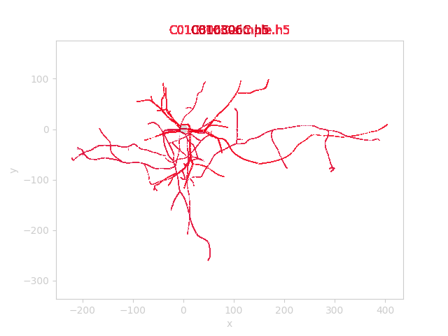
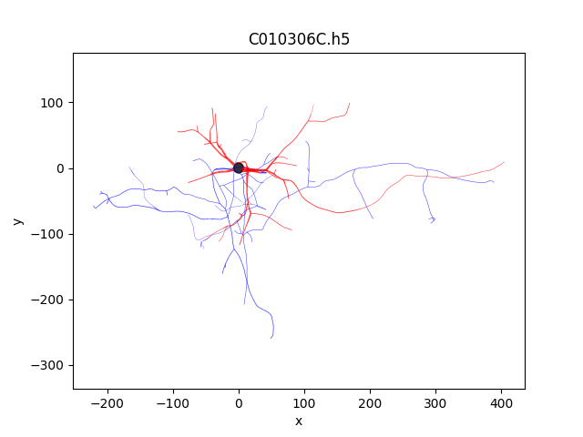

Simplify
~~~~~~~~

Using the `Ramer–Douglas–Peucker algorithm <https://en.wikipedia.org/wiki/Ramer%E2%80%93Douglas%E2%80%93Peucker_algorithm>`__, one can simplify morphologies like:

.. code:: bash

   morph-tool simplify --epsilon .5 C010306C.h5 C010306C-simple.h5

This will reduce the number of segments the morphology:

.. code:: bash

    $ h5ls -r C010306C.h5
    /                        Group
    /metadata                Group
    /points                  Dataset {2820, 4}
    /structure               Dataset {107, 3}

    $ h5ls -r C010306C-simple.h5
    /                        Group
    /metadata                Group
    /points                  Dataset {627, 4}
    /structure               Dataset {107, 3}

An image difference shows that all the sections have changed:

But the difference isn't extremely obvious by the human eye:

